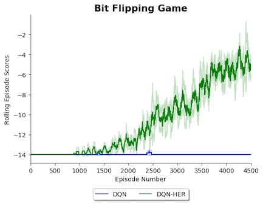
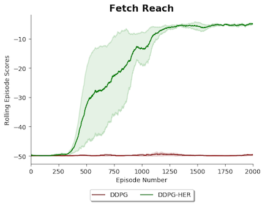

# Deep Reinforcement Learning Algorithms with PyTorch


   

This repository contains PyTorch implementations of deep reinforcement learning algorithms. 

## **Algorithms Implemented** 

1. Deep Q Learning (DQN) ([Mnih 2013](https://arxiv.org/pdf/1312.5602.pdf))  
1. DQN with Fixed Q Targets ([Mnih 2013](https://arxiv.org/pdf/1312.5602.pdf))
1. Double DQN ([Hado van Hasselt 2015](https://arxiv.org/pdf/1509.06461.pdf))
1. Double DQN with Prioritised Experience Replay ([Schaul 2016](https://arxiv.org/pdf/1511.05952.pdf))
1. REINFORCE ([Williams 1992](http://www-anw.cs.umass.edu/~barto/courses/cs687/williams92simple.pdf))
1. PPO ([Schulman 2017](https://openai-public.s3-us-west-2.amazonaws.com/blog/2017-07/ppo/ppo-arxiv.pdf))
1. DDPG ([Lillicrap 2016](https://arxiv.org/pdf/1509.02971.pdf)) 
1. Hill Climbing
1. Genetic Evolution
1. DQN with Hindsight Experience Replay (DQN-HER) ([Andrychowicz 2018](https://arxiv.org/pdf/1707.01495.pdf))
1. DDPG with Hindsight Experience Replay (DDPG-HER) ([Andrychowicz 2018](https://arxiv.org/pdf/1707.01495.pdf)) 

All implementations are able to quickly solve Cart Pole (discrete actions), Mountain Car Continuous (continuous actions), 
Bit Flipping (discrete actions with dynamic goals) or Fetch Reach (continuous actions with dynamic goals). I plan to add A2C, A3C and PPO-HER soon.


## **Results**

#### 1. Cart Pole (Discrete Actions)

Below shows DQN, DQN with Fixed Q targets, Double DQN, Double DQN with Prioritised Experience Replay and PPO playing
 [Cart Pole](https://github.com/openai/gym/wiki/CartPole-v0) for 450 episodes. The mean result from running the algorithms 
 with 3 random seeds is shown with the shaded area representing plus and minus 1 standard deviation. Hyperparameters
 used can be found in file `Results/Cart_Pole.py `. 
 


#### 2. Mountain Car (Continuous Actions)

Below shows PPO and DDPG playing [Mountain Car](https://github.com/openai/gym/wiki/MountainCarContinuous-v0) for 450 episodes. The mean result from running the algorithms with 3 random 
seeds is shown with the shaded area representing plus and minus 1 standard deviation. Hyperparameters
 used can be found in file `Results/Mountain_Car.py `


#### 3. Hindsight Experience Replay (HER) Experiements

Below shows the performance of DQN and DDPG with and without Hindsight Experience Replay (HER) in the Bit Flipping (14 bits) 
and Fetch Reach environments described in the papers [Hindsight Experience Replay 2018](https://arxiv.org/pdf/1707.01495.pdf) 
and [Multi-Goal Reinforcement Learning 2018](https://arxiv.org/abs/1802.09464). The results replicate the results in 
the papers and show how adding HER can allow an agent to solve problems that it otherwise would not be able to solve at all.  
found in the paper and show that adding HER allowed the agent to solve a problem that vanilla DQN was not able
to practically solve. Note that the same hyperparameters were used for each pair of agents and so the only difference 
between them was whether hindsight was used or not. 

 


### Usage ###

The repository's high-level structure is:
 
    ├── Agents                    
        ├── Actor_Critic_Agents   
        ├── DQN_Agents         
        ├── Policy_Gradient_Agents
        └── Stochastic_Policy_Search_Agents 
    ├── Environments
        ├── Open_AI_Gym_Environments   
        ├── Other_Environments         
        └── Unity_Environments    
    ├── Results             
        └── Data_and_Graphs        
    ├── Tests
    ├── Utilities
        ├── Data_Structures             
        └── Models            
   

#### i) To Watch the Agents Learn the Above Games  

To watch all the different agents learn the above games follow these steps:

```commandline
git clone https://github.com/p-christ/Deep_RL_Implementations.git
cd Deep_RL_Implementations

conda create --name myenvname
y
conda activate myenvname

pip3 install -r requirements.txt
export PYTHONPATH="${PYTHONPATH}:/Deep_RL_Implementations"
``` 

And then to watch them learn **Cart Pole** run:
`python Results/Cart_Pole.py`

To watch them learn **Mountain Car** run: `python Results/Mountain_Car_Continuous.py`

To watch them learn **Bit Flipping** run: `python Results/Bit_Flipping.py`

To watch them learn **Fetch Reach** run: `python Results/Fetch_Reach.py`


#### ii) To Train the Agents on your Own Game  

To use the algorithms with your own particular game instead you follow these steps:
 
1. Create an Environment class to represent your game - the environment class you create should extend the `Base_Environment` class found in the `Environments` folder to make 
it compatible with all the agents.  

2. Create a config object with the hyperparameters and game you want to use. See `Results/Cart_Pole.py` for an example of this.
3. Use class Trainer and function within it `run_games_for_agents` to have the different agents play the game. Again see `Results/Cart_Pole.py` for an example of this.
